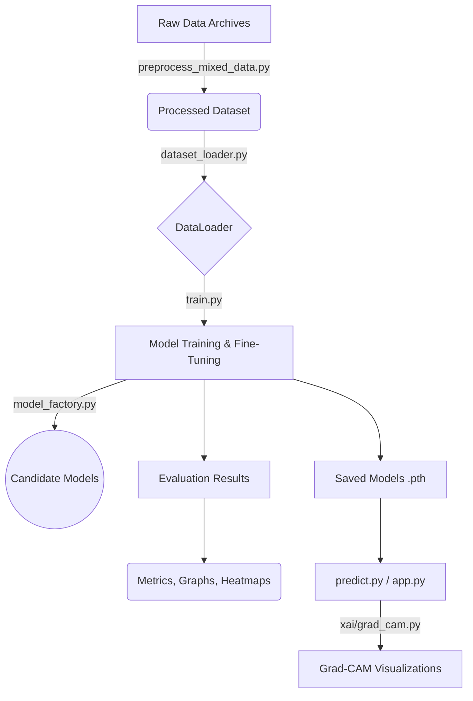

# Driver Drowsiness Detection System with Explainable AI (XAI)

A research prototype for **Driver Drowsiness Detection** with several candidate image models, Grad-CAM visualizations, and an interactive Streamlit dashboard. The project is not yet a validated safety-critical deployment.

---

## 🛠️ Libraries and Frameworks Used
- **PyTorch & Torchvision**: Core deep learning framework used for model building, training, and evaluation.
- **OpenCV**: Used for real-time video and image processing, face detection, and ROI extraction.
- **MediaPipe**: Used for high-fidelity facial landmark detection to extract eye and mouth regions.
- **Scikit-Learn**: Utilized for evaluation metrics (precision, recall, F1-score, ROC-AUC) and confusion matrix generation.
- **Matplotlib & Seaborn**: Used for plotting training curves, heatmaps, and matrices.
- **Streamlit**: Used to build the interactive web dashboard.
- **NumPy & Pandas**: Essential for numerical operations and data structuring.

---

## 📂 Project Structure & File Descriptions

| File / Directory | Purpose |
| :--- | :--- |
| `app.py` | Streamlit interactive web dashboard for real-time predictions and model comparison. |
| `train.py` | Core training script to train and fine-tune individual models (saves evaluation metrics, graphs, and models). |
| `train_all_models.py` | Script to sequentially train all candidate models and generate a comparative leaderboard. |
| `predict.py` | Inference script to predict drowsiness on a single image and generate Grad-CAM heatmaps. |
| `data/preprocess_mixed_data.py` | Unified dataset preprocessor. Merges images/videos from multiple archives into a balanced structure. |
| `data/dataset_loader.py` | PyTorch `Dataset` and `DataLoader` setup with data augmentation (Albumentations/Torchvision). |
| `models/model_factory.py` | Contains the definitions and factory functions for all candidate architectures. |
| `models/custom_cnn.py` | Defines the specific lightweight Custom CNN architecture designed for fast inference. |
| `utils/metrics.py` | Helper functions for calculating evaluation matrices, ROC curves, and logging training results. |
| `utils/face_mesh.py` | Hybrid geometric metrics implementation (e.g., EAR, MAR calculation using MediaPipe). |
| `xai/grad_cam.py` | Explainable AI engine using Gradient-weighted Class Activation Mapping to visualize model attention. |

---

## 🔄 Code Flow Diagram



---

## 📊 Evaluation Matrix

*The table below will be updated as models complete their 25-epoch fine-tuning.*

| Model Architecture | Accuracy | Precision | Recall | F1-Score | ROC-AUC | Latency (ms) | FPS |
| :--- | :--- | :--- | :--- | :--- | :--- | :--- | :--- |
| **Custom CNN** | *Training...* | - | - | - | - | - | - |
| **MobileNetV2** | *Pending...* | - | - | - | - | - | - |
| **ResNet50** | *Pending...* | - | - | - | - | - | - |

*(All evaluation graphs, confusion matrices, and ROC curves are automatically saved in the `results/` directory after each training run).*

---

## ⚡ Terminal Commands to Start the Project

### 1. Install Dependencies
```bash
python -m venv .venv
.venv\\Scripts\\activate
pip install --upgrade pip
pip install -r requirements.txt
```

### 2. Prepare Dataset
Place raw data in `archive/`, `archive(1)/`, etc., and run the preprocessor:
```bash
python data/preprocess_mixed_data.py
```

### 3. Fine-Tune a Model (e.g., Custom CNN for 25 Epochs)
```bash
python train.py --model custom_cnn --dataset_dir processed_dataset --epochs 25 --batch_size 32
```
Training checkpoints are written to `saved_models/`; the dashboard loads the best matching checkpoint from that directory.

### 4. Single Image Prediction & XAI
```bash
python predict.py --image path/to/image.jpg --model custom_cnn --out output_xai.jpg
```
Pass a trained checkpoint explicitly with `--checkpoint saved_models/custom_cnn_best_model.pth`.

### 5. Launch Interactive Dashboard
```bash
streamlit run app.py
```
